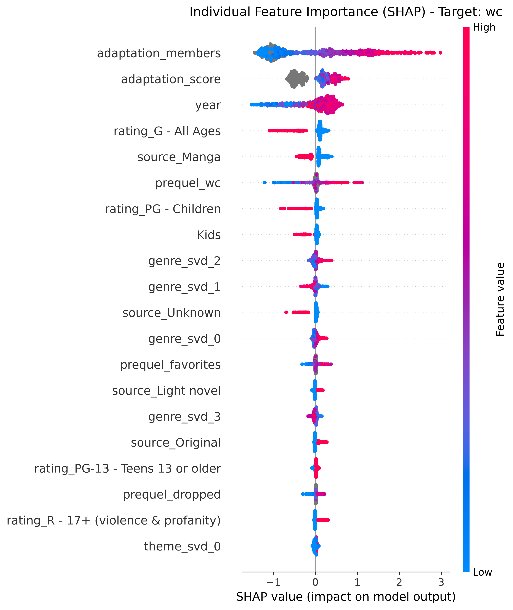

# FAL Destroyer 3000

## Goals
1. Predict MAL metrics for Fantasy Anime League roster selection (Model A)
2. Use forecasting methods to maximize points in the Fantasy Anime League (Model B)

## ETL Phase

### Data Collection

We used Tenrai API for data collection.  

Model A Data:
* Season
* Year 
* Age Rating
* Genres
* Demographics
* Themes
* Score and number of members of source material if applicable
* Metrics of prequel if applicable  

Model A Prediction Variables (which will then be used as Model B's priors):
* Score
* Watching + Completed 
* Total forum messages for first thirteen episodes (STRONG assumption: linear correlation between forum messages and unique users)
* Dropped 
* Favorites

I did some early data cleaning during the ETL phase:
* It must be a TV series, and not a movie, ONA, OVA, etc.
* It must not be currently airing
* It must have a score, since scoreless anime tend to be obscure, overly niche, or only regionally broadcast
* It must have a year and season (cohort normalization is a key part of feature engineering metrics)

## Data Cleaning
The following modifications were done:
* Dropped duplicates
* Parses through multi-valued columns such as "genre" and turns them into lists

## Interesting Findings from EDA
* Significantly more anime during Spring and Fall that pass the data cleaning criteria.
* Score means by genre are the lowest for Ecchi and Erotica, but the Ecchi genre has more outliers.
* Possibly due to a small sample size, the Villainness theme has a very narrow distribution of scores
* Score means were high during mid-to-late 90's and dipped during mid-to-late 2010's.
* While seasonal scores are mostly the same, Spring has a lot of positive outliers.
* Sequels have a higher score average, and they have significantly less outliers too. This makes sense: if you have a sequel in the first place, then the previous season must've been passable.

## Feature Engineering
* Added a "drop rate" feature (dropped / wc) for statistical analysis
* Performed log1p on wc, favorites, forum, and dropped to make them more normally distributed
* For both adaptation score and adaptation member count, the highest number out of all adaptation media types was chosen. If it did not have a recorded adaptation, we will leave it as NaN
* Performed log1p on adaptation members
* Split cohort into season and year
* Used prequel_id (if it exists) to query prequel scores. If prequel_id does not exist, then prequel metrics are left with a NaN value. Dropped prequel_id afterwards since it will not be used
* Removed the "Award Winning" genre since that label is not assigned before anime release
* Turned string features into category types for XGBoost compatibility
* Dropped episodes (mostly known only after the anime is released), mal_id (not useful), and sequel (XGBoost does not need indicator variables)
* Saved the dataframe for statistical analysis
* Split into training, validation, testing, and inference dataframes to avoid data train-test leakage (not relevant for now but will keep just in case)
* Used multi-label binarization + truncated SVD for genres, themes, studios, and producers, and only multi-label binarization for demographics

## Statistics
WIP

We will mainly be focusing on three metrics: score, wc (watching + completed) and drop rate (dropped / wc).

### Source Material
* Source material score vs. anime score yielded $R^2 = 0.497$.
* Source material member count vs. anime wc (log-log) yielded $R^2 = 0.580$.

### Prequel
* Prequel score vs. anime score yielded $R^2 = 0.804$.
* Preuqel wc vs. anime wc yielded (log-log) $R^2 = 0.954$.

### Genre
* Sports and Drama had the most positive impact on score, while Ecchi and Horror had the most negative impact.
* Suspence and Romance had the most positive impact on wc, while Horror and Adventure had the most negative impact.
* Sports and Romance were least likely to be dropped.

### Theme
* Iyashikei and Love Polygon had the most positive impact on score, while Strategy Game and Parody had the most negative impact.
* Gore and Love Polygon had the most positive impact on wc, while Pets and Mecha had the most negative impact.
* Pets and Parody were most likely to be dropped, while Iyashikei and Gore were least likely to be dropped.

### Demographics
The general trend is that the Kids demographic usually has the most negative impact on all metrics.

## Machine Learning
Two models will be tested for the fourth data pass: Random Forest and XGBoost. Both will undergo cross-validation and hyperparameter tuning via Optuna. Pruning is performed for each trial, so each trial does not have to do all 5 CV folds. Five seeds were chosen, and for each metric, random forest attained a higher R^2 score for all five metrics, with a clean 5 - 0 sweep for each metric.  

Feature importance charts calculated by SHAP values heavily suggest that source material score has a big impact on anime score, while for the rest of the metrics that are raw counts, source material popularity has the biggest impact. Here is a feature importance chart used on testing data for the WC metric, which reached $R^2 = 0.8622$:  

  

If you notice, the SHAP importance favors heavily towards the source material, but if you check the Statistics section, there was a higher correlation coefficient for prequels. This has led me to perform an OLS regression analysis between source material and prequels. The analysis showed moderate correlation (0.50 and 0.64 for score and wc, respectively), which means that it's possible that since the two are moderately correlated, the RF model put significantly more weight towards the source material.

## Forecasting

For forecasting, I used Kalman filters. Since it's too technical to put all of it in this README, I have uploaded the PDF in the docs folder. 

Since the forum variable can not be directly converted to points, we will still use a z-scoring system for our forecasting model. As a result, I made a heuristic that will decide which anime will have higher FAL points.

## Limitations
* I was not able to do AniList GraphQL API because it's highly prone to mismatched titles.
* It's possible for an anime to have two or more source materials of the same type (Manga, LN, etc). The code adaptation_collection.py only collects statistics from the lowest MAL ID instead of collecting all of them. This is done to make sure that lists are aligned and to save API calls as I have rate limits for Tenrai API. This is a justifiable approximation as this is an extreme minority edge case.
* I can only collect statistics on the day of data collection, not when the first 13 episodes were released. Hence, there will be a "slow burn" bias where old, popular shows will have inflated counts for most statistics.
* The API can only track forum posts, not unique posters. We will assume that there is a linear correlation between forum posts and unique posters.
* Some chunks of data are recorded around 24 hours apart due to rate limits, which slightly poisons our machine learning process.

## More Commit Notes (9/10)
* Polished Statistics notebook and further explored feature importance in README

## Post-commit Plans
* Draft powerpoint presentation
* Update filters on streamlit dashboard
* Add plots to streamlit dashboard

## Biggest Lessons
* Simple is best: no need for CNNs or image tagging or sentiment analysis when you can yield great results with simpler models. Choose a simple approach and check if the data you're studying makes sense in the first place. Consider trade-offs.
* Data leakage is serious: this was probably the toughest issue I've faced, especially when using cross-validation.
* Cache folds: to avoid preprocessing every optuna trial, you can cache the folds beforehand.